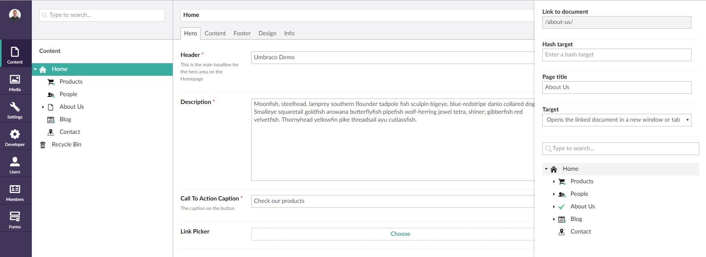

<h2>Umbraco Link Picker</h2>

A simple internal or external link picker property editor for **Umbraco 7.x**

<h3>Quick links</h3>

<ul>
<li><a href="#about-the-package">About the package</a></li>
<li><a href="#installation">Installation</a></li>
<li><a href="#usage">Usage</a></li>
<li><a href="#screenshots">Screenshots</a></li>
<li><a href="#license">License</a></li>
<li><a href="#get-involved">Get involved!</a></li>
</ul>

<h3>About the package</h4>

This package is for **Umbraco 7.x**

<h4>Features</h4>
<ul>
	<li>Integrates with Umbraco <code>linkPicker</code> (for internal or external link selection)</li>
<li>Uses Umbraco <code>linkPicker</code> to define the selected node ID, name, URL and target (for internal links) and name, URL and target (for external links)</li>
</ul>

<h3>Installation</h3>

<h4>Download</h4>

Download and install the package from our.umbraco.org: <a href="https://our.umbraco.org/projects/backoffice-extensions/link-picker" target="_blank">our.umbraco.org/projects/backoffice-extensions/link-picker</a>

<h4>NuGet</h4>

<pre>PM > Install-Package UmbracoLinkPicker</pre>

Create a new DataType in the Developer tab in your Umbraco project, referencing "Link Picker" (alias: "Gibe.LinkPicker"). Add the new DataType to your Document Types to use the Link Picker

<h3>Usage</h3>

The Link Picker returns JSON like the following example:

<pre>
{
  id: 1039,
  name: "Node Name",
  url: "/node-url",
  target: "_blank",
  hashtarget: ""
}
</pre>

The <code>url</code> can be used for external URLs and <code>id</code> can be used to get the URL of internal nodes in Umbraco (as URLs can change in Umbraco if the name changes).

If you are using dynamic, you can access the JSON data like this:

<pre>
// return an external URL
@CurrentPage.propertyName.url

// return an internal URL
@Umbraco.Content(CurrentPage.propertyName.id).Url
</pre>

If you want to use strongly-typed:

<pre>
// Strongly typed
LinkPicker link = Model.Content.GetPropertyValue<LinkPicker>("link");

// ModelsBuilder
var site = Model.Content.Site().OfType<Frontpage>();
var link = site.Link;

// From LeBlender grid editor
LinkPicker link = Model.Items.First().GetValue<LinkPicker>("link");
</pre>

<h3>Screenshots</h3>

**Step 1:** Click the "Choose" link

**Step 2:** In the Umbraco side menu, choose either an internal or external link

**Step 3a:** Set the options for external links (URL, title, etc.)

**Step 3b:** Or, set the options for internal links

**Step 4:** View or remove the link

<h3>License</h3>

The Umbraco Link Picker is created by <a href="http://www.karltynan.co.uk" target="_blank">Karl Tynan</a> for <a href="http://www.gibedigital.com" target="_blank">Gibe Digital</a> under the MIT License: [opensource.org/licenses/MIT](http://opensource.org/licenses/MIT)

<h3>Get involved!</h3>

This project is open for collaboration, so please help improve this project.
