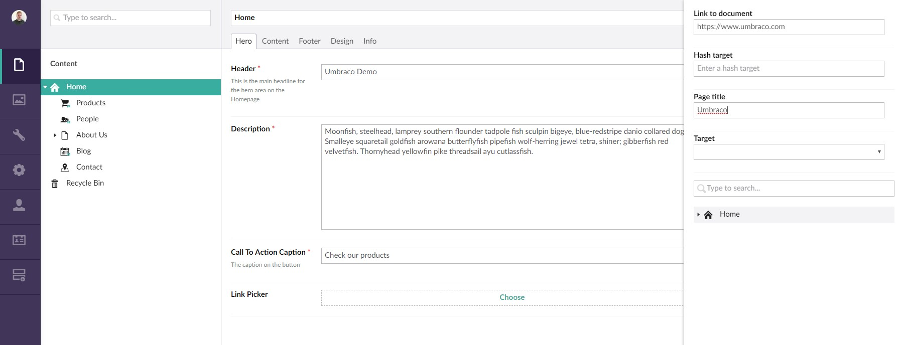

#Umbraco Link Picker
**A simple internal or external link picker property editor for Umbraco 7.x**

##About the package

This package is for **Umbraco 7.x** (Belle).

**Features:**
- Integrates with Umbraco linkPicker (for internal or external link selection)
- Uses Umbraco linkPicker to define the selected node ID, name, URL and target (for internal links) and name, URL and target (for external links)

##Installation

##Install using package

1. Download the package from the Umbraco project repo (coming soon)

###Install using NuGet

1. Install the package using NuGet (coming soon)

##Screenshots

Step 1: Click the picker choose link

Step 2: Choose either an internal or external link

Step 3a: Set the options for an external link

Step 3b: Set the options for an internal link

Step 4: View or remove the link

##License

The Umbraco Link Picker is created by <a href="http://www.karltynan.co.uk" target="_blank">Karl Tynan</a> for <a href="http://www.gibedigital.com" target="_blank">Gibe Digital</a> under the MIT License: [opensource.org/licenses/MIT](http://opensource.org/licenses/MIT)

##Get involved!

This project is open for collaboration, so please help improve this project.