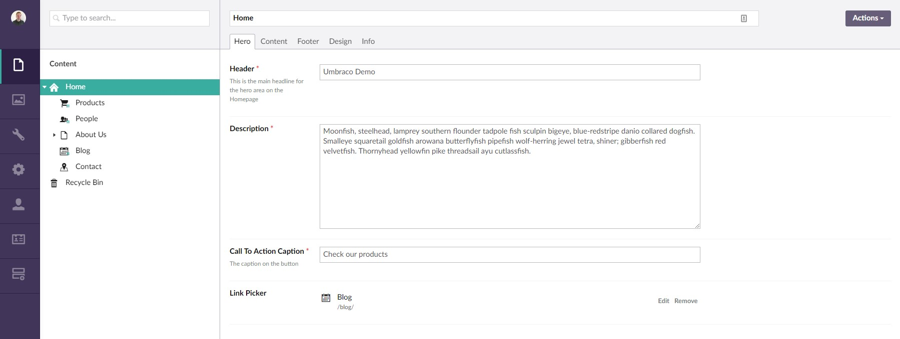

#Umbraco Link Picker

**A simple internal or external link picker property editor for Umbraco 7.x**

##Quick links

- <a href="#about-the-package">About the package</a>
- <a href="#installation">Installation</a>
- <a href="#usage">Usage</a>
- <a href="#screenshots">Screenshots</a>
- <a href="#license">License</a>
- <a href="#get-involved">Get involved!</a>

##About the package

This package is for **Umbraco 7.x** (Belle).

**Features:**
- Integrates with Umbraco linkPicker (for internal or external link selection)
- Uses Umbraco linkPicker to define the selected node ID, name, URL and target (for internal links) and name, URL and target (for external links)

##Installation

###Install using package

1. Download and install the package from our.umbraco: <a href="https://our.umbraco.org/projects/backoffice-extensions/link-picker" target="_blank">our.umbraco.org/projects/backoffice-extensions/link-picker</a>
2. Create a new DataType in the Developer tab in your Umbraco project, referencing "Link Picker" (alias: "Gibe.LinkPicker")
3. Add the new DataType to your Document Types to use the Link Picker

###Install using NuGet

PM > Install-Package UmbracoLinkPicker

##Usage

The Link Picker returns JSON like the following example:

<pre>
{
	id: 1039,
	name: "Node Name",
	url: "/node-url",
	target: "_blank",
	hashtarget: ""
}
</pre>

If you are using dynamic, you can access the JSON data like this:

<pre>
// return url
@CurrentPage.propertyName.url

// return name
@CurrentPage.propertyName.name
</pre>

If you are using strongly-typed, or want to deserialize the JSON, then use <code>Newtonsoft.Json</code> to access the data using a model:

<pre>
var data = JsonConvert.DeserializeObject(value.ToString());

public class LinkPickerModel
{
	public int Id { get; set; }
	public string Name { get; set; }
	public string Url { get; set; }
	public string Target { get; set; }
	public string Hashtarget { get; set; }
}
</pre>

##Screenshots

**Step 1:** Click the "Choose" link

**Step 2:** In the Umbraco side menu, choose either an internal or external link

**Step 3a:** Set the options for external links (URL, title, etc.)

**Step 3b:** Or, set the options for internal links

**Step 4:** View or remove the link

##License

The Umbraco Link Picker is created by <a href="http://www.karltynan.co.uk" target="_blank">Karl Tynan</a> for <a href="http://www.gibedigital.com" target="_blank">Gibe Digital</a> under the MIT License: [opensource.org/licenses/MIT](http://opensource.org/licenses/MIT)

##Get involved!

This project is open for collaboration, so please help improve this project.
